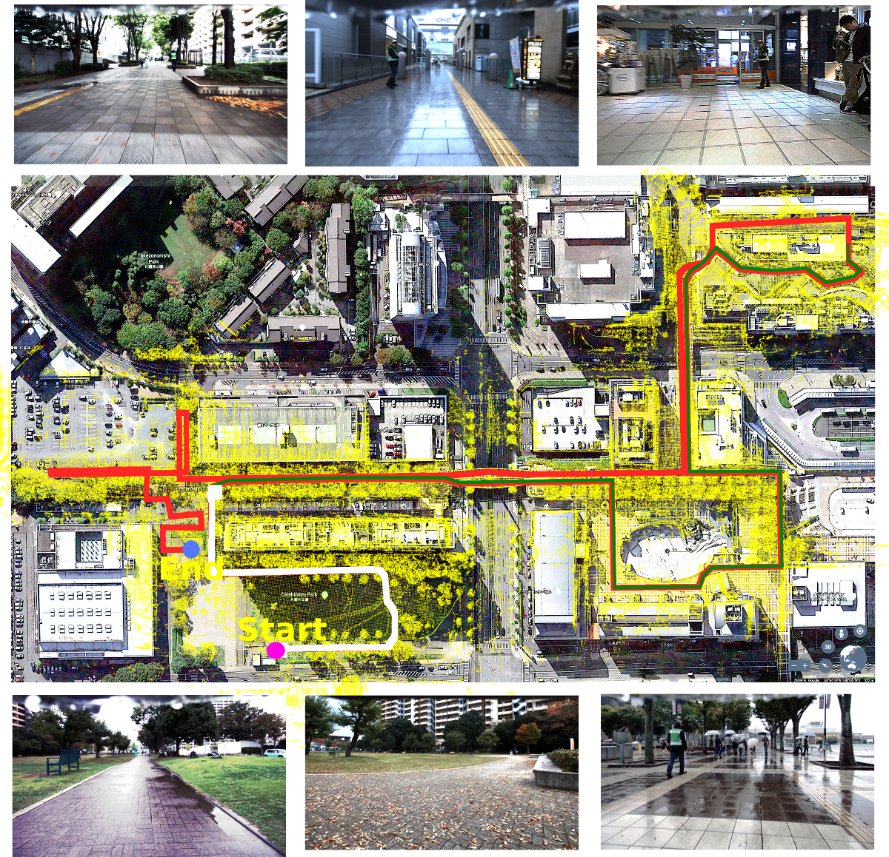
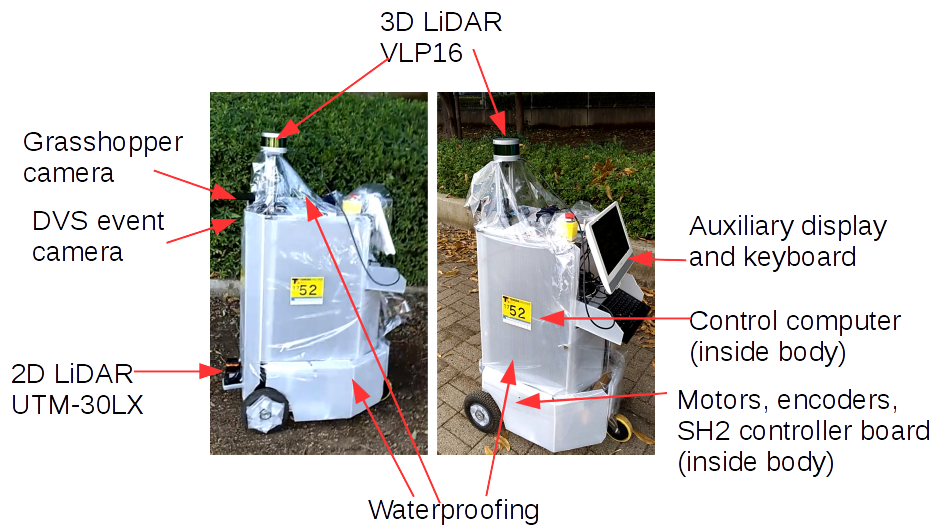

# TC2017

Open-source software developed/modified by the Meidai Autonomous Driving (MAD) group (Nagoya University, Japan) for our participation at Tsukuba Challenge 2017.

Tsukuba Challenge 2017 couse and scenes:



Our NUIV robot:



The software includes:
- Autoware: fork of [CPFL/Autoware](https://github.com/CPFL/Autoware) modified for our robot
- E2E (end-to-end): software and models
- RobotControl: SSM and SHSpur libraries
- Maps: point-cloud maps and vector maps (indoor and outdoor)

## Environment
This software was developed and tested on the following environment:
- Mobile robot with SH2 board running SH-Spur software
- CPU Intel Xeon E3-1545M 8 cores
- 32GB RAM
- NVIDIA M1000M with 4GB GPU RAM
- ROS kinetic (Ubuntu 16.04)
- TensorFlow

## How to Build
- Get the software
```
$ cd $HOME
$ git clone https://github.com/MAVRG/TC2017.git 
```
- Autoware
```
$ cd ~/TC2017/Autoware/ros/src
$ catkin_init_workspace
$ cd ../
$ ./catkin_make_release
```
- RobotControl
```
$ cd ~/TC2017/RobotControl/ssm-shspur-ros/SSM-0.32
$ make
$ sudo make install
$ cd ../sh_spur-0.11/
$ make
$ sudo make install
$ cd ~/TC2017/RobotControl/ssm-shspur-ros/catkin_ws/src
$ catkin_init_workspace
$ cd ..
$ catkin_make
```
- E2E
```
$ cd ~/TC2017/E2E/tsukuba_ws/src
$ catkin_init_workspace
$ cd ..
$ source ~/TC2017/Autoware/ros/devel/setup.bash
$ catkin_make
```


## How to Start
- Autoware 
```
$ cd ~/TC2017/Autoware/ros
$ ./run
```
- RobotControl: joystick operation
```
$ cd ~/TC2017/RobotControl/ssm-shspur-ros
$ ./AutoKerberos.sh  [optional argument: path to record rosbag]
```
- RobotControl: autonomous operation from Autoware
```
$ cd ~/TC2017/RobotControl/ssm-shspur-ros
$ ./Automove-log.sh  [optional argument: path to record rosbag]
```
- E2E
```
$ cd ~/TC2017/E2E/Cyclops
$ ./Cyclops-log.sh  [optional argument: path to record rosbag]
```
## Videos

[End-to-End and Autoware switching](https://youtu.be/i5KQHxArOFk)

[Tsukuba Challenge 2017 finals](https://youtu.be/44D_8pGVjYY)

## Sample Data

[Nagoya University](Maps/meidai)

[Takeda-Lab corridor](Maps/takeda-ken)

[Tsukuba](Maps/tsukuba)

## ROSBAG STORE
[ROSBAG recorded on 2017-10-15](https://rosbag.tier4.jp/rosbag_details/?id=212)

